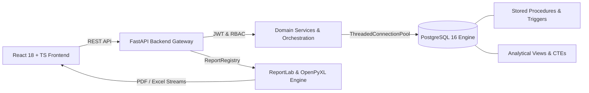

# PropLedger — Property Management & Analytics Platform

[](https://www.postgresql.org/)
[](https://fastapi.tiangolo.com/)
[](https://react.dev/)
[](https://www.docker.com/)
[](reporting/ssrs-equivalent/)
[](LICENSE)

> **PropLedger** is an enterprise-grade, SQL-centric property management and financial analytics platform modeling residential and commercial real estate operations. Designed as a high-caliber showcase for software engineering, SQL application support, and institutional reporting.

---

## Technical Highlights & Architecture Centerpiece

PropLedger is intentionally engineered around a high-performance relational database core, strict transactional business logic, and code-driven publication reporting:

1. **Advanced SQL Engine**: Complex multi-table JOINs, ordinary & recursive CTEs, window functions (`ROW_NUMBER`, `RANK`, `LAG`, `LEAD`, `SUM OVER`), cross-tabulation PIVOT analysis, conditional aggregation, and indexed views.
2. **Transactional Integrity**: ACID-compliant payment processing with atomic FIFO allocation and automatic rollback on failure (`usp_RecordPayment`).
3. **SSRS-Equivalent Dual Reporting Suite**: Comprehensive 14-report institutional suite (`PL-095` to `PL-108`) with parameter validation, OpenPyXL formula-driven Excel workbooks, and ReportLab two-pass `NumberedCanvas` (`Page X of Y`) PDF exports generated in sub-second execution.
4. **Batch Generation CLI**: Standalone batch generation tool (`generate_all_reports.py`) producing all 28 binary report artifacts in 8.5 seconds.
5. **Modern Single-Page Application**: React 18 + TypeScript + Vite frontend with role-based navigation, SVG financial charts, and live report catalog with data previews and one-click downloads.

---

## System Architecture



For complete architectural documentation, refer to [`docs/architecture/architecture-overview.md`](docs/architecture/architecture-overview.md).

---

## Phase Progression & Status

Development follows a strict 10-phase, phase-gated execution model:

| Phase | Description | Status | Completion Report |
|---|---|---|---|
| **Phase 0** | **Requirements & Execution Control** | ✅ **COMPLETE** | [`phase-00-completion.md`](docs/phases/phase-00-completion.md) |
| **Phase 1** | **Database Foundation & Schema** | ✅ **COMPLETE** | [`phase-01-completion.md`](docs/phases/phase-01-completion.md) |
| **Phase 2** | **Advanced SQL & Programmability** | ✅ **COMPLETE** | [`phase-02-completion.md`](docs/phases/phase-02-completion.md) |
| **Phase 3** | **Business Workflows & Transactions** | ✅ **COMPLETE** | [`phase-03-completion.md`](docs/phases/phase-03-completion.md) |
| **Phase 4** | **FastAPI Backend API & Domain Services** | ✅ **COMPLETE** | [`phase-04-completion.md`](docs/phases/phase-04-completion.md) |
| **Phase 5** | **React 18 Application** | ✅ **COMPLETE** | [`phase-05-completion.md`](docs/phases/phase-05-completion.md) |
| **Phase 6** | **SSRS Reporting Equivalent** | ✅ **COMPLETE** | [`phase-06-completion.md`](docs/phases/phase-06-completion.md) |
| **Phase 7** | **Crystal Reports Equivalent** | ✅ **COMPLETE** | [`phase-07-completion.md`](docs/phases/phase-07-completion.md) |
| **Phase 8** | **Performance Engineering & Benchmarks** | ✅ **COMPLETE** | [`phase-08-completion.md`](docs/phases/phase-08-completion.md) |
| **Phase 9** | Testing & Quality Validation | ⏳ Next | `docs/phases/phase-09-completion.md` |
| **Phase 10**| Interview & Portfolio Packaging | 🔴 Queued | `docs/phases/phase-10-completion.md` |

---

## Running Batch Reports & Formal Statements

### SSRS-Equivalent Institutional Reports (14 Reports $\times$ Excel/PDF = 28 Artifacts)
```bash
cd reporting/ssrs-equivalent
python generate_all_reports.py
pytest tests/test_reporting_engine.py -v
```
All outputs are saved to `reporting/ssrs-equivalent/output/`.

### Crystal Reports Equivalent Section-Banded Statements (3 Production Statements)
```bash
cd reporting/crystal-equivalent
python generate_formal_statements.py
pytest tests/test_crystal_reports.py -v
```
Generates CR-01 (Tenant Statement with Remittance Slip), CR-02 (Columnar Rent Roll with Economic Occupancy), and CR-03 (Multi-Step Income & Expense Statement) in `reporting/crystal-equivalent/output/`.

### Performance Engineering & Benchmark Suite (526k+ Records)
```bash
cd performance/benchmarks
python run_benchmarks.py
```
Profiles 5 core operational workloads with `EXPLAIN (ANALYZE, BUFFERS)` in baseline and optimized states, saving raw execution plans to `performance/before/` and `performance/after/`.

---

## Documentation Navigation

- **Requirements Traceability Matrix**: [`docs/requirements/requirements-traceability.md`](docs/requirements/requirements-traceability.md)
- **Performance Benchmark Results (526k Transactions)**: [`docs/performance/benchmark-results.md`](docs/performance/benchmark-results.md)
- **Enterprise Indexing Strategy Guide**: [`docs/performance/indexing-strategy.md`](docs/performance/indexing-strategy.md)
- **Performance Case Studies**:
  - [01 — Property Occupancy & Portfolio Aggregation](docs/performance/01-property-occupancy.md)
  - [02 — Tenant Payment History Ledger & Sort Elimination](docs/performance/02-payment-history.md)
  - [03 — Monthly Rent Collection Aggregation](docs/performance/03-rent-collection.md)
  - [04 — Delinquency Aging Report Under Heavy Volume](docs/performance/04-delinquency.md)
  - [05 — Multi-Year Financial Performance Summary Rollup](docs/performance/05-financial-summary.md)
- **Multi-Reporting Engine Architectural Comparison**: [`docs/reports/reporting-comparison.md`](docs/reports/reporting-comparison.md)
- **Report Catalog (14 Institutional Reports)**: [`docs/reports/report-catalog.md`](docs/reports/report-catalog.md)
- **SSRS Replacement Case Study**: [`docs/reports/client-requirement-case-study.md`](docs/reports/client-requirement-case-study.md)
- **Business Rules Register (BR-01 to BR-10)**: [`docs/requirements/business-rules.md`](docs/requirements/business-rules.md)
- **Environment & Dependency Audit**: [`docs/requirements/dependency-checklist.md`](docs/requirements/dependency-checklist.md)
- **Architecture Overview**: [`docs/architecture/architecture-overview.md`](docs/architecture/architecture-overview.md)
- **Phase Gate Criteria**: [`docs/phases/phase-gates.md`](docs/phases/phase-gates.md)
