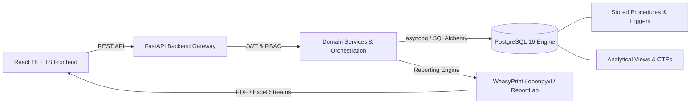

# PropLedger — Property Management & Analytics Platform

> **PropLedger** is a near-enterprise, SQL-centric property management and financial analytics platform modeling residential and commercial real estate operations. Designed as a high-caliber showcase for software engineering, SQL application support, and enterprise reporting.

---

## Technical Highlights & Architecture Centerpiece

PropLedger is intentionally engineered around a high-performance relational database core and strict transactional business logic:

1. **Advanced SQL Engine**: Complex multi-table JOINs, ordinary & recursive CTEs, window functions (`ROW_NUMBER`, `RANK`, `LAG`, `LEAD`, `SUM OVER`), cross-tabulation PIVOT analysis, conditional aggregation, and indexed views.
2. **Transactional Integrity**: ACID-compliant payment processing with atomic allocation and automatic rollback on failure (`usp_RecordPayment`).
3. **Dual Reporting Suite**: Comprehensive 14-report suite featuring parameterized execution, multi-level grouping, aggregations, conditional formatting, and dual export engines (PDF via WeasyPrint, Excel via openpyxl, plus formal statement layouts via ReportLab).
4. **Performance Engineering**: Rigorous execution plan analysis (`EXPLAIN ANALYZE`) across 5 real-world query bottlenecks with before-and-after benchmarks and indexing case studies.
5. **Application Support & Diagnostics**: Real-time diagnostic monitors, slow query detection, and structured troubleshooting incident logs.

---

## System Architecture

For complete architectural documentation, refer to [`docs/architecture/architecture-overview.md`](docs/architecture/architecture-overview.md).

---

## Phase Progression & Status

Development follows a strict 10-phase, phase-gated execution model:

| Phase | Description | Status | Completion Report |
|---|---|---|---|
| **Phase 0** | **Requirements & Execution Control** | ✅ **COMPLETE** | [`phase-00-completion.md`](docs/phases/phase-00-completion.md) |
| **Phase 1** | **Database Foundation & Schema** | ✅ **COMPLETE** | [`phase-01-completion.md`](docs/phases/phase-01-completion.md) |
| **Phase 2** | **Advanced SQL & Programmability** | ✅ **COMPLETE** | [`phase-02-completion.md`](docs/phases/phase-02-completion.md) |
| **Phase 3** | **Business Workflows & Transactions** | ✅ **COMPLETE** | [`phase-03-completion.md`](docs/phases/phase-03-completion.md) |
| **Phase 4** | **FastAPI Backend API & Domain Services** | ✅ **COMPLETE** | [`phase-04-completion.md`](docs/phases/phase-04-completion.md) |
| **Phase 5** | React 18 Application | ⏳ Next | `docs/phases/phase-05-completion.md` |
| **Phase 6** | SSRS Reporting Equivalent | 🔴 Queued | `docs/phases/phase-06-completion.md` |
| **Phase 7** | Crystal Reports Equivalent | 🔴 Queued | `docs/phases/phase-07-completion.md` |
| **Phase 8** | Performance Engineering & Benchmarks | 🔴 Queued | `docs/phases/phase-08-completion.md` |
| **Phase 9** | Testing & Quality Validation | 🔴 Queued | `docs/phases/phase-09-completion.md` |
| **Phase 10**| Interview & Portfolio Packaging | 🔴 Queued | `docs/phases/phase-10-completion.md` |

---

## Documentation Navigation

- **Requirements Traceability Matrix**: [`docs/requirements/requirements-traceability.md`](docs/requirements/requirements-traceability.md)
- **Business Rules Register (BR-01 to BR-10)**: [`docs/requirements/business-rules.md`](docs/requirements/business-rules.md)
- **Environment & Dependency Audit**: [`docs/requirements/dependency-checklist.md`](docs/requirements/dependency-checklist.md)
- **Architecture Overview**: [`docs/architecture/architecture-overview.md`](docs/architecture/architecture-overview.md)
- **Reporting Pipeline Specification**: [`docs/architecture/reporting-pipeline.md`](docs/architecture/reporting-pipeline.md)
- **Relational Database Design Baseline**: [`docs/database/database-design.md`](docs/database/database-design.md)
- **Entity Relationship Diagram**: [`docs/database/er-diagram-preliminary.md`](docs/database/er-diagram-preliminary.md)
- **Phase Gate Criteria**: [`docs/phases/phase-gates.md`](docs/phases/phase-gates.md)
