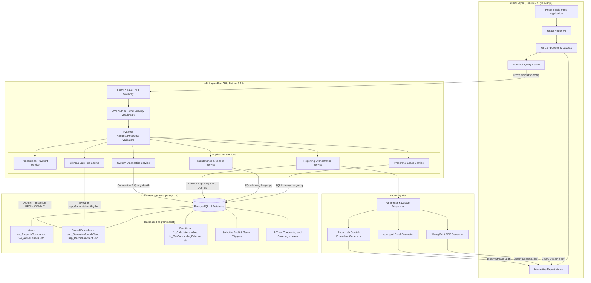

# PropLedger — High-Level Architecture Overview
## Technical Architecture, Component Hierarchy, and Data Flows

---

## 1. Architecture Diagram



---

## 2. Component Responsibilities & Boundaries

| Tier | Component | Technology | Primary Responsibilities |
|---|---|---|---|
| **Frontend** | Single Page App | React 18, TypeScript, Tailwind CSS, Lucide Icons | Responsive navigation, role-based views, dashboards, forms, real-time feedback, report rendering |
| **Data Fetching** | Client State & Cache | TanStack Query v5 | Server state caching, optimistic updates, query invalidation after mutations, pagination |
| **Charts** | Data Visualization | Recharts / Chart.js | Visualizing occupancy trends, revenue collection, delinquency aging, maintenance distribution |
| **API Gateway** | REST API | FastAPI, Uvicorn | Routing, request serialization, OpenAPI/Swagger docs, CORS, rate limiting |
| **Security** | Auth & Authorization | `python-jose`, `passlib` (bcrypt) | JWT token creation/verification, password hashing, fine-grained RBAC dependency injection |
| **Orchestration**| Application Services | Pure Python 3.14 | Business logic orchestration, validation, error handling, audit log assembly |
| **Reporting** | Report Engine | `WeasyPrint`, `openpyxl`, `ReportLab` | Parameterized execution, multi-level grouping, subtotals, conditional formatting, PDF/Excel compilation |
| **Database** | Relational Engine | PostgreSQL 16 | Relational storage, referential integrity, ACID transactions, PL/pgSQL procedures, views, indexing |

---

## 3. Authoritative Source of Truth Policy (PRD Part T & Part AU)

To eliminate calculation discrepancies across tiers, PropLedger strictly follows the **Single Source of Truth** principle:

```
[SQL Relational Engine / Stored Procedures / Views]
                    ↓ (Authoritative Calculation)
         [FastAPI Application Services]
                    ↓ (Structured API Response)
         [React Client Visualization]
```

- **Rule 1**: The frontend **never** independently calculates financial metrics (e.g. outstanding balance, delinquency status, late fee). It strictly displays values supplied by the backend.
- **Rule 2**: The backend API relies on database functions and stored procedures (`fn_CalculateLateFee`, `fn_GetOutstandingBalance`, `usp_GetDelinquencyReport`) for domain rules.
- **Rule 3**: Any change to late fee rates or grace periods in the database immediately reflects across all reports, dashboards, and API endpoints without code redeployment.

---

## 4. Role-Based Access Control (RBAC) Matrix

| User Role | Properties & Units | Leases & Tenants | Payments & Rent | Delinquency & Collections | Maintenance & Work Orders | Financial Reports | System Diagnostics |
|---|---|---|---|---|---|---|---|
| **ADMIN** | Full Control | Full Control | Full Control | Full Control | Full Control | Full Access | Full Access |
| **PROPERTY_MANAGER**| Create / Edit | Create / Edit | View Only | View / Action | Assign / Resolve | Full Access | View Only |
| **LEASING_STAFF** | View Only | Create / Renew | View Only | View Only | View Only | None | None |
| **ACCOUNTANT** | View Only | View Only | Create / Reconcile| Manage Cases | View Costs | Full Access | None |
| **MAINTENANCE_STAFF**| View Only | View Only | None | None | Update Status / Cost | None | None |
| **OWNER** | View Assigned | View Assigned | View Summary | View Summary | View Summary | Owner Reports Only | None |
| **TENANT** | View Assigned Unit | View Own Lease | Pay / View History| View Own Balance | Submit / View Own | None | None |

---

## 5. Core Data Lifecycle Narratives

### A. Lease & Rent Lifecycle
1. Property Manager creates unit and enters market rent.
2. Leasing staff associates tenant with unit under an active lease (`start_date`, `end_date`, `monthly_rent`, `grace_period_days`).
3. Nightly batch or manual trigger executes `usp_GenerateMonthlyRent`, generating `rent_charges` for all active leases.
4. Tenant receives charge notification in portal.

### B. Payment & Delinquency Lifecycle
1. Tenant submits payment (full or partial).
2. `PaymentService` invokes `usp_RecordPayment` within an atomic transaction.
3. Charge balance is reduced; if balance remains after grace period, `fn_CalculateLateFee` assesses fee.
4. If unpaid beyond 30 days, tenant is categorized into delinquency aging buckets (1–30, 31–60, 61–90, 90+ days).
5. Collection case is initiated for delinquent accounts.

### C. Maintenance Request Lifecycle
1. Tenant or Property Manager logs maintenance request (Category, Priority, Description).
2. Maintenance staff assigns request to vendor or technician via `work_orders`.
3. Work is performed, actual cost and resolution notes are logged, status updates to `RESOLVED` then `CLOSED`.
4. Business Rule BR-08 prevents any subsequent work orders from being attached without explicit manager reopening.
