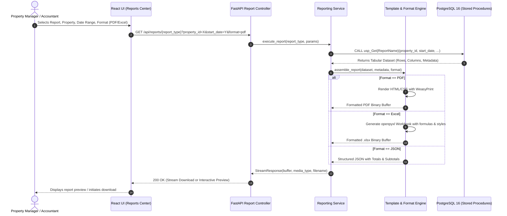

# PropLedger — Reporting Engine & Pipeline Architecture
## Specification of the Parameterized Reporting Workflow (PRD Part V & Q)

---

## 1. End-to-End Reporting Workflow

The reporting pipeline translates high-level user parameters into high-performance SQL queries and formatted, presentation-ready documents.

---

## 2. All 14 Required Report Families (Catalog Overview)

| # | Report Name | Parameters | Grouping / Aggregation | Output Formats |
|---|---|---|---|---|
| **01** | **Property Occupancy Report** | `as_of_date`, `property_id` | Group by Property, Building; Sum units, compute Occupancy % | PDF, Excel, JSON |
| **02** | **Unit Availability Report** | `property_id`, `unit_type`, `rent_min`, `rent_max` | Group by Unit Type; Sort by Rent Ascending | PDF, Excel, JSON |
| **03** | **Tenant Directory** | `property_id`, `status` | Group by Property; Alphabetical by Tenant Name | PDF, Excel, JSON |
| **04** | **Lease Expiration Report** | `from_date`, `to_date`, `property_id` | Group by Expiration Month; Days Remaining calculation | PDF, Excel, JSON |
| **05** | **Monthly Rent Collection Report** | `billing_month`, `property_id` | Group by Property; Expected vs Collected vs Outstanding | PDF, Excel, JSON |
| **06** | **Delinquency Report** | `as_of_date`, `aging_bucket`, `property_id` | Group by Aging Bucket (1-30, 31-60, 61-90, 90+); Subtotals | PDF, Excel, JSON |
| **07** | **Tenant Payment History** | `tenant_id`, `lease_id`, `from_date`, `to_date` | Chronological ledger with running balance column | PDF, Excel, JSON |
| **08** | **Security Deposit Report** | `property_id`, `status` | Group by Property; Total held, deductions, refunds | PDF, Excel, JSON |
| **09** | **Maintenance Performance Report** | `property_id`, `from_date`, `to_date` | Group by Category & Vendor; Average resolution days, total cost | PDF, Excel, JSON |
| **10** | **Property Income & Expense Report**| `property_id`, `year`, `quarter` | Group by Category (Income vs Expense); Net Operating Income | PDF, Excel, JSON |
| **11** | **Monthly Property Summary** | `property_id`, `month`, `year` | Combined executive dashboard (Occupancy, Revenue, Work Orders) | PDF, Excel, JSON |
| **12** | **Owner / Executive Dashboard Report**| `owner_id`, `as_of_date` | Multi-property rollup; Occupancy, Net Income, Cap Rate estimate | PDF, Excel, JSON |
| **13** | **Rent Roll** | `property_id`, `as_of_date` | Unit-by-unit listing: Tenant, Rent, Lease Start/End, Balance | PDF, Excel, JSON |
| **14** | **Lease Renewal Report** | `from_date`, `to_date`, `renewal_status` | Group by Renewal Status (Pending, Renewed, Non-Renewal) | PDF, Excel, JSON |

---

## 3. PDF Layout & Styling Standards (WeasyPrint)

- **Page Architecture**: Standard A4 Landscape / Portrait with `@page` CSS margins, running header (`PropLedger Property Management`), and running footer (`Page {page} of {pages} | Generated on {timestamp}`).
- **Visual Hierarchy**: Corporate navy header bar (`#1E293B`), alternate zebra row shading (`#F8FAFC`), currency right-alignment, status badges with subtle background fills.
- **Totals & Aggregations**: Highlighted summary bands with bold font, top border (`1px solid #CBD5E1`), and double bottom border (`3px double #0F172A`).
- **Page Breaks**: Intelligent `page-break-inside: avoid` on summary cards and signature blocks to prevent awkward orphaned table rows.

---

## 4. Excel Export Standards (openpyxl)

- **Workbook Structure**: Clean title block, parameter metadata block (Date Range, Property, Generated By), followed by formatted data table.
- **Formulas**: Subtotals and Grand Totals use real Excel formulas (`=SUM(E6:E25)`) rather than static numbers, allowing financial analysts to audit calculations.
- **Column Auto-Sizing**: Dynamic column width calculation to prevent clipped text or `###` overflow indicators.
- **Freeze Panes**: Header rows frozen at row 5 for continuous scrolling on large datasets.

---

## 5. Crystal Reports Equivalent Layout (ReportLab)

For the 3 formal statements mandated in PRD Part R:
1. **Tenant Payment History Statement**
2. **Property Rent Roll Official Schedule**
3. **Property Income & Expense Statutory Statement**

These are generated using a dedicated `ReportLab` module that demonstrates:
- Exact point-level typography (`Helvetica-Bold`, `Helvetica-Oblique`, 8pt–14pt).
- Multi-tier formal accounting lines (single top line, double bottom line).
- Precise millimeter alignment for certified audit statements.
- Direct interview talking point: Explaining the technical distinction between flow-based reporting (SSRS/HTML) and coordinate-based reporting (Crystal/ReportLab).
