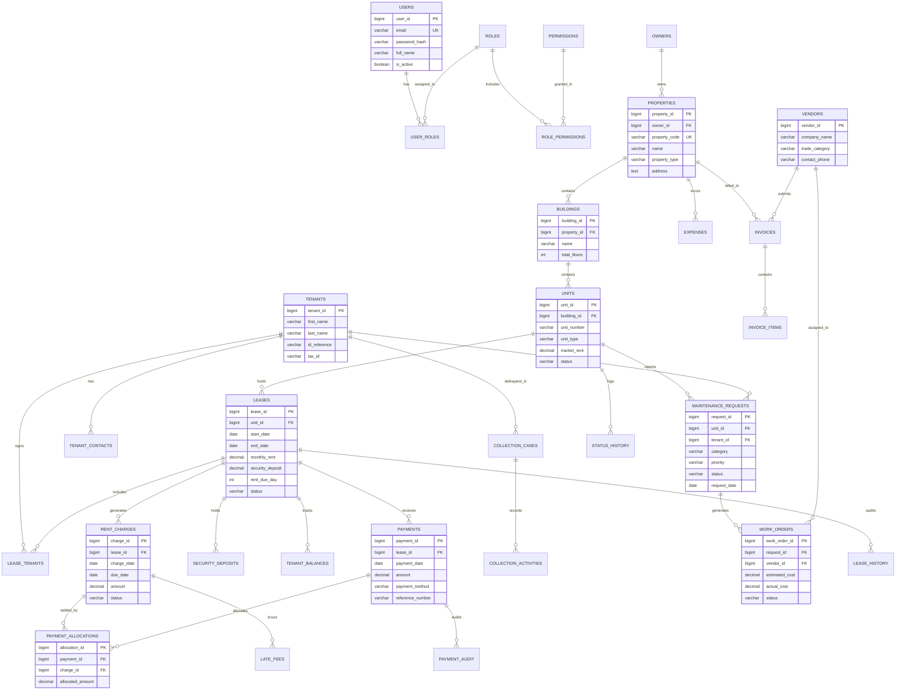

# PropLedger — Entity Relationship (ER) Diagram
## Comprehensive Entity Mapping and Cardinality (PRD Part M)

---

```mermaid
erDiagram
    USERS ||--o{ USER_ROLES : has
    ROLES ||--o{ USER_ROLES : assigned_to
    ROLES ||--o{ ROLE_PERMISSIONS : includes
    PERMISSIONS ||--o{ ROLE_PERMISSIONS : granted_in

    OWNERS ||--o{ PROPERTIES : owns
    PROPERTIES ||--o{ BUILDINGS : contains
    BUILDINGS ||--o{ UNITS : contains
    PROPERTIES ||--o{ EXPENSES : incurs
    PROPERTIES ||--o{ INVOICES : billed_to

    UNITS ||--o{ LEASES : hosts
    TENANTS ||--o{ LEASE_TENANTS : signs
    LEASES ||--o{ LEASE_TENANTS : includes
    LEASES ||--o{ RENT_CHARGES : generates
    LEASES ||--o{ SECURITY_DEPOSITS : holds
    LEASES ||--o{ TENANT_BALANCES : tracks

    RENT_CHARGES ||--o{ PAYMENT_ALLOCATIONS : settled_by
    RENT_CHARGES ||--o{ LATE_FEES : incurs
    PAYMENTS ||--o{ PAYMENT_ALLOCATIONS : allocates
    LEASES ||--o{ PAYMENTS : receives

    TENANTS ||--o{ TENANT_CONTACTS : has
    TENANTS ||--o{ COLLECTION_CASES : delinquent_in
    COLLECTION_CASES ||--o{ COLLECTION_ACTIVITIES : records

    UNITS ||--o{ MAINTENANCE_REQUESTS : reports
    TENANTS ||--o{ MAINTENANCE_REQUESTS : requests
    MAINTENANCE_REQUESTS ||--o{ WORK_ORDERS : generates
    VENDORS ||--o{ WORK_ORDERS : assigned_to
    VENDORS ||--o{ INVOICES : submits
    INVOICES ||--o{ INVOICE_ITEMS : contains

    LEASES ||--o{ LEASE_HISTORY : audits
    PAYMENTS ||--o{ PAYMENT_AUDIT : audits
    UNITS ||--o{ STATUS_HISTORY : logs

    USERS {
        bigint user_id PK
        varchar email UK
        varchar password_hash
        varchar full_name
        boolean is_active
    }

    PROPERTIES {
        bigint property_id PK
        bigint owner_id FK
        varchar property_code UK
        varchar name
        varchar property_type
        text address
    }

    BUILDINGS {
        bigint building_id PK
        bigint property_id FK
        varchar name
        int total_floors
    }

    UNITS {
        bigint unit_id PK
        bigint building_id FK
        varchar unit_number
        varchar unit_type
        decimal market_rent
        varchar status
    }

    TENANTS {
        bigint tenant_id PK
        varchar first_name
        varchar last_name
        varchar id_reference
        varchar tax_id
    }

    LEASES {
        bigint lease_id PK
        bigint unit_id FK
        date start_date
        date end_date
        decimal monthly_rent
        decimal security_deposit
        int rent_due_day
        varchar status
    }

    RENT_CHARGES {
        bigint charge_id PK
        bigint lease_id FK
        date charge_date
        date due_date
        decimal amount
        varchar status
    }

    PAYMENTS {
        bigint payment_id PK
        bigint lease_id FK
        date payment_date
        decimal amount
        varchar payment_method
        varchar reference_number
    }

    PAYMENT_ALLOCATIONS {
        bigint allocation_id PK
        bigint payment_id FK
        bigint charge_id FK
        decimal allocated_amount
    }

    MAINTENANCE_REQUESTS {
        bigint request_id PK
        bigint unit_id FK
        bigint tenant_id FK
        varchar category
        varchar priority
        varchar status
        date request_date
    }

    WORK_ORDERS {
        bigint work_order_id PK
        bigint request_id FK
        bigint vendor_id FK
        decimal estimated_cost
        decimal actual_cost
        varchar status
    }

    VENDORS {
        bigint vendor_id PK
        varchar company_name
        varchar trade_category
        varchar contact_phone
    }
```
